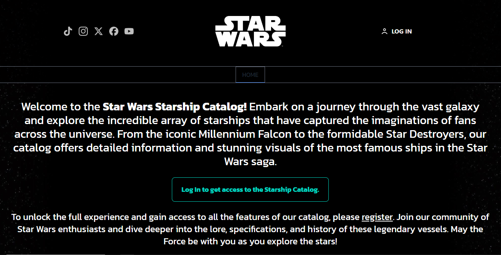

# Star Wars | Wiki


## Description 📃

**Star Wars Wiki** is a web application that provides detailed information about the starships in the Star Wars universe. Built with React, Tailwind CSS, Firebase, and Redux, this app allows users to search and explore data on various starships, with up-to-date information presented in a visually appealing manner.

## Technologies Used 

- **React**: JavaScript library for building user interfaces.
- **Tailwind CSS**: CSS framework for modern and responsive design.
- **Firebase**: Application development platform for real-time database and authentication.
- **Redux**: Library for global state management in the application.

## Features 🎉

- **Starship list**: General view of each starship in Starwars Universe.
- **Details for each starship**: Detailed view of each starship with comprehensive information.
- **Details for each starship's pilot**: Clicked Ship Pilots Overview
- **Films**: List of films where each starship appear.
- **Authentication**: User registration and login via Firebase Authentication.

## URL Starwars-Wiki - vercel ⚡

[Star Wars Wiki](https://starwars-wiki-react.vercel.app/)

## Installation 💻

Follow these steps to clone and run the project locally.

1. Clone the repository:
   ```sh
   git clone https://github.com/tomi-casabona/Starwars-React-JS
   ```
2. Navigate to the project directory:
   ```sh
   cd Starwars-React-JS
   ```
3. Install dependencies:
   ```sh
   npm install
   ```
4. Create a `.env.local` file in the project root with your Firebase credentials:

   ```
   VITE_FIREBASE_API_KEY=your_api_key
   VITE_FIREBASE_AUTH_DOMAIN=your_auth_domain
   VITE_FIREBASE_PROJECT_ID=your_project_id
   VITE_FIREBASE_STORAGE_BUCKET=your_storage_bucket
   VITE_FIREBASE_MESSAGING_SENDER_ID=your_messaging_sender_id
   VITE_FIREBASE_APP_ID=your_app_id
   VITE_FIREBASE_MEASUREMENT_ID=your_firebase_measurement_id

   ```

5. Start the application:
   ```sh
   npm run dev
   ```

The application should be available at [http://localhost:5173](http://localhost:5173).

## Firebase Project Setup

This README will guide you through the steps required to create a project in Firebase and configure the necessary environment variables to integrate it with an application using Vite.

### Step 1: Create a Project in Firebase

1. Go to [Firebase Console](https://console.firebase.google.com/).
2. Click on "Add project".
3. Enter a name for your project and follow the on-screen instructions to create it.

### Step 2: Obtain Your Firebase Credentials

1. In the Firebase console, select the project you just created.
2. Go to the "Settings" section (gear icon) in the top left corner.
3. Click on "Project settings".
4. Scroll down to the "Your apps" section.
5. Select the web app for which you want to obtain the credentials, or click on "Add app" if you haven't created one yet.
6. Copy the provided credentials, including:
   - API Key
   - Auth Domain
   - Project ID
   - Storage Bucket
   - Messaging Sender ID
   - App ID
   - Measurement ID

### Step 3: Configure Environment Variables

1. Open your project in the code editor.
2. Create a `.env.local` file in the root of the project if it doesn't already exist.
3. Add the following environment variables to the `.env.local` file with the credentials you copied in the previous step:

## Usage

1. **Sign In**: Sign in to have acces to the app.
2. **View Starship List**: Scroll through the starship list.
3. **View Details**: Click on your favourite starship card to view details.
4. **View Pilots and Movies**: Scroll down to see the pilots and the movies it appears.

---

Thank you for using Star Wars Starships Catalog!
May the Force be with you!

---

## Images




