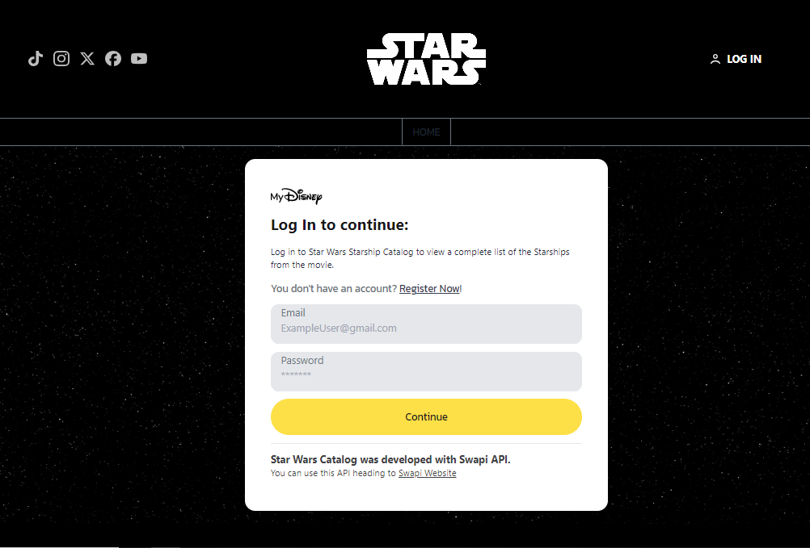

# Star Wars | Wiki


## Description

**Star Wars Wiki** is a web application that provides detailed information about the starships in the Star Wars universe. Built with React, Tailwind CSS, Firebase, and Redux, this app allows users to search and explore data on various starships, with up-to-date information presented in a visually appealing manner.

## Technologies Used

- **React**: JavaScript library for building user interfaces.
- **Tailwind CSS**: CSS framework for modern and responsive design.
- **Firebase**: Application development platform for real-time database and authentication.
- **Redux**: Library for global state management in the application.

## Features

- **Starship list**: General view of each starship in Starwars Universe.
- **Details for each starship**: Detailed view of each starship with comprehensive information.
- **Details for each starship's pilot**: Clicked Ship Pilots Overview
- **Films**: List of films where each starship appear.
- **Authentication**: User registration and login via Firebase Authentication.

## Installation

Follow these steps to clone and run the project locally.

1. Clone the repository:
   ```sh
   git clone https://github.com/tomi-casabona/Starwars-React-JS
   ```
2. Navigate to the project directory:
   ```sh
   cd Starwars-React-JS
   ```
3. Install dependencies:
   ```sh
   npm install
   ```
4. Create a `.env.local` file in the project root with your Firebase credentials:

   ```
   VITE_FIREBASE_API_KEY=your_api_key
   VITE_FIREBASE_AUTH_DOMAIN=your_auth_domain
   VITE_FIREBASE_PROJECT_ID=your_project_id
   VITE_FIREBASE_STORAGE_BUCKET=your_storage_bucket
   VITE_FIREBASE_MESSAGING_SENDER_ID=your_messaging_sender_id
   VITE_FIREBASE_APP_ID=your_app_id
   VITE_FIREBASE_MEASUREMENT_ID=your_firebase_measurement_id

   ```

5. Start the application:
   ```sh
   npm run dev
   ```

The application should be available at [http://localhost:5173](http://localhost:5173).

## Usage

1. **Sign In**: Sign in to have acces to the app.
2. **View Starship List**: Scroll through the starship list.
3. **View Details**: Click on your favourite starship card to view details.
4. **View Pilots and Movies**: Scroll down to see the pilots and the movies it appears.

---

Thank you for using Star Wars Starships Catalog!
May the Force be with you!

---

## URL Starwars-Wiki - vercel

[Star Wars Wiki](https://starwars-wiki-react.vercel.app/)

## Images





